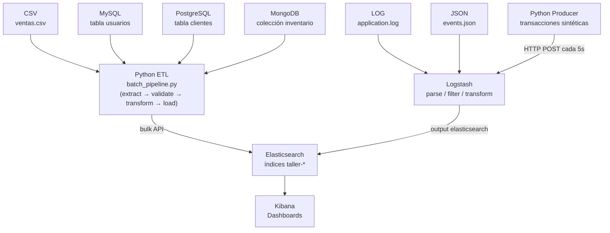
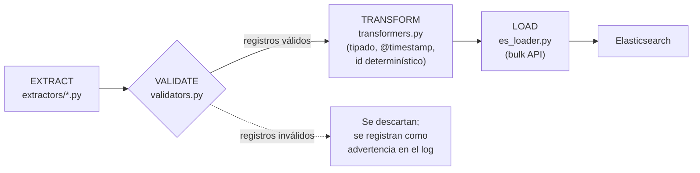
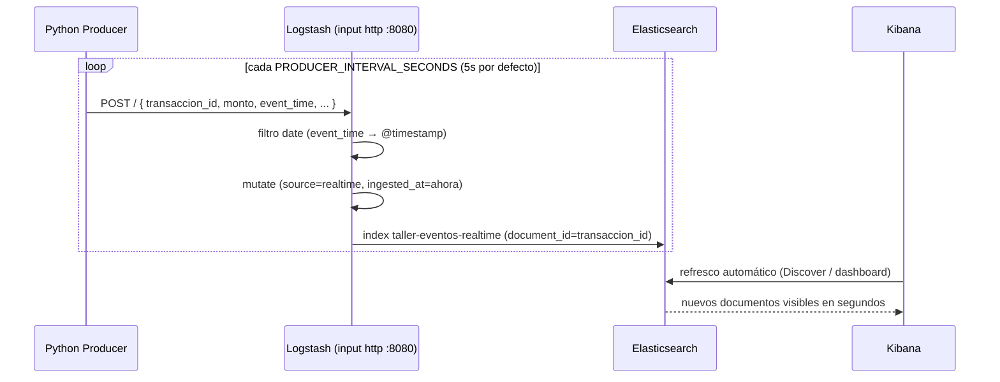

# Plataforma de Ingesta y Streaming Near-Real Time

## Autores
- Evelyn Bermeo Granda
- Oldrin Bonilla Cáceres

Flujo de datos con **ELK (Elasticsearch, Logstash, Kibana)** en esquema **mixto batch + near real-time**, con **7 fuentes de datos de tipos distintos**: CSV, LOG, JSON, MySQL, PostgreSQL, MongoDB y un productor de eventos en tiempo casi real.

El proyecto es reproducible con Docker Compose: con `docker compose up -d` el pipeline completo queda operativo, desde la generación/extracción de datos hasta los índices en Elasticsearch, sin pasos manuales adicionales.

---

## Tabla de contenidos

1. [Objetivo](#1-objetivo)
2. [Arquitectura](#2-arquitectura)
3. [Tecnologías](#3-tecnologías)
4. [Fuentes de datos](#4-fuentes-de-datos)
5. [Flujo batch](#5-flujo-batch)
6. [Flujo near real-time](#6-flujo-near-real-time)
7. [Estructura del proyecto](#7-estructura-del-proyecto)
8. [Instalación](#8-instalación)
9. [Configuración](#9-configuración)
10. [Ejecución](#10-ejecución)
11. [Pruebas](#11-pruebas)
12. [Kibana](#12-kibana)
13. [Observabilidad](#13-observabilidad)
14. [Decisiones de diseño](#14-decisiones-de-diseño)
15. [Limitaciones conocidas](#15-limitaciones-conocidas)
16. [Conclusiones](#16-conclusiones)

---

## 1. Objetivo

Diseño e implementación de un flujo de datos con ELK en esquema near real-time, integrando al menos 4 fuentes de datos de diferentes tipos, combinando un flujo **batch** (fuentes que cambian con baja frecuencia) y un flujo **near real-time** (datos que llegan de forma continua).

El proyecto cubre el ciclo completo: ingesta desde fuentes heterogéneas, validación, transformación (ETL), carga en Elasticsearch y visualización en Kibana, con observabilidad y pruebas automatizadas.

---

## 2. Arquitectura



El diagrama de la consigna muestra las 7 fuentes embarcando hacia Logstash. En este proyecto la ingesta se divide en dos rutas según la naturaleza técnica de cada fuente (justificación completa en la sección 14):

- **CSV, MySQL, PostgreSQL, MongoDB**: extracción, validación y transformación en Python (pandas / SQLAlchemy / pymongo), con carga directa a Elasticsearch vía bulk API. Flujo ETL.
- **LOG, JSON, productor near real-time**: transporte y parseo en Logstash (grok, kv, json, http), que corresponde al caso de uso para el que Logstash está diseñado.

La razón principal de la separación es que Logstash no cuenta con un input oficial mantenido por Elastic para MongoDB, y el input `jdbc` para MySQL/PostgreSQL depende de un driver `.jar` que debe descargarse manualmente, lo cual introduce un punto de fallo evitable. El archivo `logstash/reference/mysql_jdbc.conf.reference` documenta esa alternativa sin activarla por defecto.

---

## 3. Tecnologías

| Tecnología | Rol en el proyecto |
|---|---|
| Elasticsearch 9.4.5 | Almacenamiento e indexación; motor de agregaciones para Kibana |
| Logstash 9.4.5 | Transporte y parseo de LOG/JSON/HTTP (grok, kv, json, date, fingerprint) |
| Kibana 9.4.5 | Visualización y dashboards |
| Python 3.12 | Extracción, validación, transformación, carga y generación de eventos |
| pandas / SQLAlchemy / pymongo / pymysql / psycopg2 | Acceso a CSV, MySQL, PostgreSQL y MongoDB |
| MySQL 8.0 / PostgreSQL 16 / MongoDB 7.0 | Fuentes relacionales y documental |
| Docker Compose | Orquestación de los 10 servicios del proyecto |
| pytest | Pruebas unitarias y de integración ligera (mocks) |
| Apache Airflow 3.x (referencia, opcional) | DAG de ejemplo para orquestar el mismo batch |

---

## 4. Fuentes de datos

| # | Fuente | Tipo | Mecanismo de ingesta | Índice destino |
|---|--------|------|----------------------|-----------------|
| 1 | `data/raw/ventas.csv` | Archivo tabular (CSV) | Python + pandas → bulk API | `taller-ventas-csv` |
| 2 | `data/raw/application.log` | Log semiestructurado | Logstash (file input + grok + kv) | `taller-logs-app` |
| 3 | `data/raw/events.json` | JSON Lines | Logstash (file input + codec json_lines) | `taller-eventos-json` |
| 4 | MySQL, tabla `usuarios` | Relacional | Python + SQLAlchemy/pymysql → bulk API | `taller-mysql-usuarios` |
| 5 | PostgreSQL, tabla `clientes` | Relacional | Python + SQLAlchemy/psycopg2 → bulk API | `taller-postgres-clientes` |
| 6 | MongoDB, colección `inventario` | NoSQL documental | Python + pymongo → bulk API | `taller-mongo-productos` |
| 7 | Productor Python (transacciones) | Streaming sintético | Logstash (input http) | `taller-eventos-realtime` |

Los datos son sintéticos, generados de forma reproducible (semilla fija, `random.seed(42)`) por `scripts/generate_sample_data.py`, y ya vienen materializados en el repositorio.

Cada documento, sin importar la fuente, comparte tres campos comunes: `source` (nombre de la fuente), `@timestamp` (momento del evento) e `ingested_at` (momento de procesamiento). Esto permite una visualización unificada agregando sobre el índice `taller-*` (sección 12).

---

## 5. Flujo batch



Flujo ETL (Extract → Transform → Load): la transformación ocurre en Python antes de que el dato llegue a Elasticsearch. Corre en el contenedor `python-batch`, en un ciclo que se repite cada `BATCH_INTERVAL_SECONDS` (120s por defecto), con logging estructurado de los registros extraídos, validados y cargados en cada ciclo.

Cubre CSV, MySQL, PostgreSQL y MongoDB. Cada fuente se procesa en su propio `try/except`: si una falla, las demás continúan y el error queda registrado en el log sin detener el proceso completo.

El flujo de Logstash (LOG/JSON/realtime) transporta y transforma en el mismo paso (grok/kv/date/mutate), pero conceptualmente la transformación también ocurre antes de la escritura en Elasticsearch, por lo que es igualmente ETL. El proyecto no usa ELT en ningún punto.

---

## 6. Flujo near real-time



El contenedor `python-producer` genera una transacción sintética (monto, método de pago, tienda) cada `PRODUCER_INTERVAL_SECONDS` y la envía por HTTP POST al input `http` de Logstash. Antes de enviar transacciones reales, el productor realiza un "warm-up": envía un evento de prueba y reintenta con backoff hasta confirmar que Logstash ya cargó el pipeline (detalle en la sección 14).

"Near real-time" implica latencia de segundos (típicamente 1-3s entre la generación del evento y su aparición en Elasticsearch), no streaming de milisegundos (ver sección 15).

---

## 7. Estructura del proyecto

```
Taller-02-ETL/
├── docker-compose.yml          # orquesta los 10 servicios
├── .env                        # variables de entorno
├── .env.example                 # plantilla documentada
├── .gitignore
├── Makefile                     # atajos: make up / down / test / status
├── pytest.ini
├── README.md
│
├── data/
│   ├── raw/                     # ventas.csv, application.log, events.json
│   └── processed/               # reservado para salidas intermedias
│
├── init-scripts/
│   ├── mysql/init.sql           # seed de la tabla usuarios (80 filas)
│   ├── postgres/init.sql        # seed de la tabla clientes (70 filas)
│   └── mongo/init.js            # seed de la colección inventario (90 docs)
│
├── python/
│   ├── Dockerfile                # imagen compartida por batch/producer/es-init/kibana-init
│   ├── requirements.txt
│   ├── config/settings.py        # variables de entorno centralizadas
│   ├── utils/                    # logger, cliente ES, retry/backoff
│   ├── extractors/                # csv / mysql / postgres / mongo
│   ├── validators/                 # reglas de calidad de datos
│   ├── transformers/                # tipado, @timestamp, ids determinísticos
│   ├── loaders/                    # bulk insert a Elasticsearch
│   ├── producers/                   # generador de eventos near real-time
│   └── pipelines/batch_pipeline.py  # orquestador ETL
│
├── airflow/
│   └── dags/batch_pipeline_dag.py   # DAG de referencia (Airflow 3.x, opcional)
│
├── logstash/
│   ├── config/                       # logstash.yml, pipelines.yml
│   └── pipeline/                     # logs.conf, events_json.conf, realtime_http.conf
│
├── logstash/reference/
│   └── mysql_jdbc.conf.reference     # alternativa jdbc documentada, fuera de pipeline/
│
├── elasticsearch/
│   └── templates/                    # 7 index templates (mappings explícitos)
│
├── scripts/
│   ├── generate_sample_data.py       # genera los datos sintéticos
│   ├── setup_es_templates.py         # servicio one-shot es-init
│   ├── setup_kibana_index_patterns.py # servicio one-shot kibana-init
│   └── healthcheck_all.sh             # verificación rápida (make status)
│
└── tests/                             # pruebas (pytest)
```

---

## 8. Instalación

**Requisitos previos:**

- Docker Desktop (o Docker Engine + plugin Compose V2), comando `docker compose`.
- Al menos 6-8 GB de RAM disponibles para Docker (10 contenedores: Elasticsearch, Kibana, Logstash, 3 bases de datos y 4 servicios Python).
- Puertos libres en el host: `9200, 5601, 8080, 9600, 3306, 5432, 27017`.

**Pasos:**

```bash
# 1. Clonar o descomprimir el proyecto
cd Taller-02-ETL

# 2. Revisar/editar .env si es necesario
cat .env

# 3. Levantar todo
docker compose up -d

# 4. Verificar el estado (puede tardar 1-2 min en converger)
docker compose ps
```

---

## 9. Configuración

Las variables de entorno están en `.env` (`.env.example` documenta cada una).

Si algún puerto ya está en uso, cambiar el `*_EXTERNAL_PORT` correspondiente en `.env` antes de levantar el proyecto:

```env
MYSQL_EXTERNAL_PORT=3307
POSTGRES_EXTERNAL_PORT=5433
MONGO_EXTERNAL_PORT=27018
```

La comunicación entre contenedores (python-batch → mysql, logstash → elasticsearch, etc.) usa siempre los puertos internos por nombre de servicio Docker y no se ve afectada por estos cambios.

---

## 10. Ejecución

```bash
docker compose up -d          # levantar todo
docker compose ps             # ver estado (healthy / exited / restarting)
docker compose logs -f logstash
docker compose logs -f python-batch
docker compose logs -f python-producer
make status                   # o: bash scripts/healthcheck_all.sh
docker compose down           # detener (conserva los datos en volúmenes)
docker compose down -v        # detener y borrar también los datos
```

Estado esperado en `docker compose ps`:

- `elasticsearch`, `kibana`, `logstash`, `mysql`, `postgres`, `mongodb`: `running (healthy)`.
- `es-init`, `kibana-init`: `exited (0)`. Son servicios de un solo uso que aplican configuración una vez y terminan; `exited (0)` indica que terminaron correctamente. Para volver a ejecutarlos: `docker compose run --rm es-init`.
- `python-batch`, `python-producer`: `running`, reiniciando su ciclo indefinidamente (`restart: unless-stopped`).

Tras aproximadamente 2 minutos, los 7 índices `taller-*` existen en Elasticsearch con documentos, y `taller-eventos-realtime` continúa creciendo cada 5 segundos mientras el stack esté activo.

---

## 11. Pruebas

El proyecto incluye pruebas automatizadas en `tests/`.

| Archivo | Tipo | Qué cubre |
|---|---|---|
| `test_validators.py` | Unitaria | Campos requeridos, números positivos, fechas ISO |
| `test_transformers.py` | Unitaria | Tipado, campos comunes, idempotencia del id generado |
| `test_extractors_mocked.py` | Integración ligera (mocks) | CSV (archivo temporal), MySQL y MongoDB (driver mockeado) |
| `test_es_loader_mocked.py` | Integración ligera (mocks) | Construcción de acciones bulk, id determinístico, conteo de errores |
| `test_producer.py` | Unitaria + mocks | Generación de eventos, envío HTTP (mockeado) |
| `test_wait_for.py` | Unitaria | Lógica de reintentos con backoff |

Ejecución local (no requiere Docker):

```bash
pip install -r python/requirements.txt --break-system-packages
python3 -m pytest
# o: make test
```

Las pruebas mockeadas validan la lógica de cada componente sin depender de MySQL/PostgreSQL/MongoDB/Elasticsearch corriendo, y complementan la verificación manual contra los servicios reales (sección 13).

---

## 12. Kibana

### 12.1. Index patterns

El servicio `kibana-init` crea automáticamente, vía la API de Kibana, un index pattern por cada fuente (`taller-ventas-csv*`, `taller-logs-app*`, etc.) más uno unificado `taller-*`, todos con `@timestamp` como campo de tiempo. Si no se crean automáticamente, revisar `docker compose logs kibana-init` o crearlos manualmente en **Kibana → Stack Management → Index Patterns**.

### 12.2. Visualizaciones sugeridas

En **Kibana → Visualize Library → Create visualization → Lens**:

1. Total de eventos: métrica, índice `taller-*`, agregación *Count*.
2. Eventos por minuto: línea, índice `taller-eventos-realtime*`, eje X `@timestamp` (date histogram, intervalo *minute*), eje Y *Count*.
3. Eventos por categoría: barra o pie, índice `taller-ventas-csv*`, split por `categoria`.
4. Evolución temporal por fuente: línea, índice `taller-*`, eje X `@timestamp`, *break down by* `source`.
5. Valor promedio de venta: métrica, índice `taller-ventas-csv*`, agregación *Average* sobre `total`.
6. Top categorías/productos: tabla, índice `taller-ventas-csv*` o `taller-mongo-productos*`, *Top values* sobre `categoria` o `producto.keyword`.
7. Errores de aplicación: barra, índice `taller-logs-app*`, filtro `log_level: ERROR`, eje X `@timestamp`.
8. Datos por fuente: pie, índice `taller-*`, split por `source`.

---

## 13. Observabilidad

```bash
make status
# equivalente a: bash scripts/healthcheck_all.sh
```

Reporta el estado de los 10 contenedores, salud del cluster de Elasticsearch, conteo de documentos por índice `taller-*`, estado de Kibana, estadísticas de eventos in/out por pipeline de Logstash, y las últimas líneas de log de `python-batch` y `python-producer`.

Verificaciones puntuales:

```bash
# Conteo de documentos por índice
curl -s "http://localhost:9200/_cat/indices/taller-*?v&h=index,docs.count"

# Ver un documento de ejemplo
curl -s "http://localhost:9200/taller-eventos-realtime/_search?size=1&pretty"

# Dead Letter Queue de Logstash
docker compose exec logstash ls -la /usr/share/logstash/data/dead_letter_queue
```

La latencia del flujo near real-time se calcula comparando `@timestamp` (generación del evento) con `ingested_at` (procesamiento), por ejemplo con un runtime field en Kibana (`Stack Management → Index Patterns → taller-eventos-realtime* → Add field`, script Painless `emit(doc['ingested_at'].value.toInstant().toEpochMilli() - doc['@timestamp'].value.toInstant().toEpochMilli())`), obteniendo típicamente unos pocos cientos de milisegundos a 1-2 segundos.

---

## 14. Decisiones de diseño

**Elasticsearch** se eligió como motor de almacenamiento por estar optimizado para agregaciones sobre grandes volúmenes de datos semiestructurados, a diferencia de una base relacional que no está pensada para las agregaciones tipo dashboard (conteos, promedios, top-N, series temporales) que requiere Kibana.

**Logstash** resuelve el parseo de LOG y JSON con componentes probados (grok, kv, codecs), evitando reimplementar ese trabajo en Python. Para el flujo near real-time, su input `http` evita levantar un broker de mensajería adicional.

**Kibana** se usó en lugar de Grafana por su integración nativa con Elasticsearch (mismo query DSL, mismo ciclo de release), sin necesitar un datasource plugin adicional.

**Python para CSV, MySQL, PostgreSQL y MongoDB.** El diagrama de la consigna muestra estas fuentes embarcando directo a Logstash. Se optó por Python en su lugar por las siguientes razones: el input `jdbc` de Logstash para MySQL/PostgreSQL requiere descargar manualmente el driver `.jar` correspondiente, una dependencia externa que puede fallar según la red de quien ejecute el proyecto; Elastic no mantiene oficialmente un input para MongoDB; y pandas es la herramienta estándar para ingestión tabular en Python, con control total sobre la validación previa al tipado. La alternativa jdbc se documenta en `logstash/reference/mysql_jdbc.conf.reference`, sin activarse por defecto.

**Airflow como componente opcional.** Una instalación completa de Airflow requiere webserver, scheduler y base de datos de metadatos propios, lo cual añade varios contenedores y consumo de RAM adicional para un taller individual que ya corre 10 contenedores. El orquestador propio (`batch_pipeline.py`) cubre el mismo requisito (programación, reintentos, logging, manejo de errores independiente por fuente) sin ese costo. Se incluye un DAG de referencia (`airflow/dags/batch_pipeline_dag.py`) que reutiliza las mismas funciones de extracción/transformación/carga.

**Separación batch / near real-time.** CSV, MySQL, PostgreSQL y MongoDB representan datos de baja frecuencia de cambio, sin valor añadido en transmitirlos como streaming. El productor Python simula la fuente que genuinamente llega de forma continua (transacciones), donde tiene sentido observar baja latencia en Kibana.

**Número de fuentes.** El enunciado pide un mínimo de 4 fuentes de tipos distintos; se implementaron las 7 mostradas en el diagrama de la consigna (CSV, LOG, JSON, Python, MySQL, PostgreSQL, MongoDB).

**ETL frente a ELT.** En ETL la transformación ocurre antes de llegar al destino final; es el caso de `pipelines/batch_pipeline.py`, que extrae, valida y tipa en Python antes de cargar a Elasticsearch. En ELT el dato crudo llega primero al destino y se transforma allí (por ejemplo con un ingest pipeline de Elasticsearch). Este proyecto no usa ELT en ningún punto: el flujo de Logstash transporta y transforma en el mismo paso, pero la transformación ocurre antes de la escritura final. Convertir el parseo de logs a un ingest pipeline de Elasticsearch es una alternativa válida no implementada aquí, para mantener el parseo en la herramienta diseñada para ese propósito.

**Calidad de datos.** Se garantiza mediante: validación explícita antes de transformar (`validators.py`), con descarte y registro en log de los registros inválidos; mappings explícitos por índice (`elasticsearch/templates/*.json`) en lugar de mapeo dinámico; e IDs determinísticos (clave natural o fingerprint del contenido) que garantizan idempotencia al reprocesar datos.

**Verificación de la carga de datos.** `scripts/healthcheck_all.sh` reporta el conteo de documentos por índice y el estado de cada servicio. Cada ciclo de batch registra en el log los registros extraídos, validados, cargados y fallidos. La Dead Letter Queue de Logstash está habilitada, de forma que un documento rechazado por Elasticsearch queda registrado en lugar de perderse.

**Warm-up del productor.** El healthcheck de Logstash (puerto 9600) confirma que el proceso está activo, pero no que el pipeline `realtime_http.conf` terminó de cargar en el puerto 8080. Por ello `event_producer.py` reintenta un POST de prueba con backoff antes de enviar datos reales.

---

## 15. Limitaciones conocidas

- La latencia del flujo near real-time es de segundos (HTTP más procesamiento de Logstash), no de milisegundos; un broker de mensajería (Kafka/RabbitMQ) con consumidores dedicados quedaría fuera del alcance de este taller.
- Elasticsearch y Kibana corren sin autenticación (`xpack.security.enabled=false`), de forma deliberada para simplificar el entorno de desarrollo local de un solo nodo. En producción debe habilitarse.
- No hay réplicas configuradas en Elasticsearch (`number_of_replicas: 0`), correcto para un cluster de un solo nodo.
- El input `jdbc` de Logstash está documentado pero no activo por defecto, por la fragilidad de depender de una descarga externa del driver.
- No se configuró Index Lifecycle Management (ILM), dado el volumen reducido de datos del taller.
- El input `jdbc`, de habilitarse, realiza polling y no Change Data Capture real; CDC real requeriría Debezium y un broker de mensajería.
- Correr los 10 contenedores simultáneamente requiere 6-8 GB de RAM libres para Docker.
- El setting `path.config` de `logstash.yml`, si se define, activa el modo de pipeline único (equivalente a `-f <ruta>`) e ignora `pipelines.yml`; si la ruta es un directorio, además carga todos los archivos que encuentre sin filtrar por extensión. Por esta razón `logstash.yml` no define `path.config` (el multi-pipeline vive solo en `pipelines.yml`), y el pipeline de referencia jdbc se ubica fuera de `logstash/pipeline/`.

---

## 16. Conclusiones

El proyecto implementa un flujo de datos heterogéneo (7 fuentes, 4 tipos técnicos distintos: archivo plano, log semiestructurado, relacional y documental NoSQL) combinando batch y near real-time sobre una arquitectura ELK, con separación clara de responsabilidades entre extracción, validación, transformación y carga, tanto en el código Python como en los pipelines de Logstash. Incluye mecanismos de calidad de datos (validación, mappings explícitos, idempotencia), observabilidad (healthchecks, conteos, logs estructurados, Dead Letter Queue) y pruebas automatizadas de la lógica crítica.