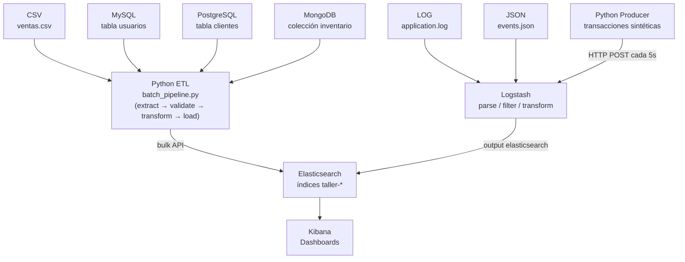
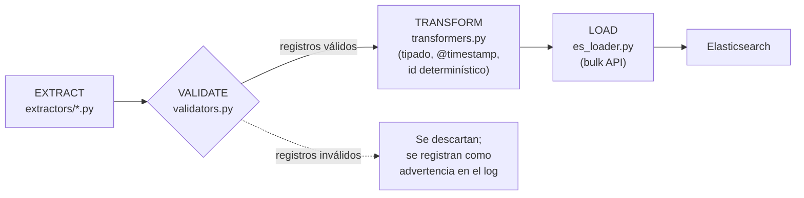
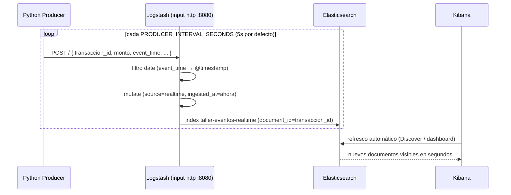

# Taller-02-ETL

Flujo de datos con **ELK (Elasticsearch, Logstash, Kibana)** en esquema **mixto batch + near real-time**, integrando **7 fuentes de datos de tipos distintos**: CSV, LOG, JSON, MySQL, PostgreSQL, MongoDB y un productor Python de eventos en tiempo casi real.

Proyecto 100% reproducible con Docker Compose: `docker compose up -d` y el pipeline completo — desde la generación/extracción de datos hasta los índices en Elasticsearch — queda operativo sin pasos manuales adicionales.

---

## Tabla de contenidos

1. [Objetivo](#1-objetivo)
2. [Arquitectura](#2-arquitectura)
3. [Tecnologías](#3-tecnologías)
4. [Fuentes de datos](#4-fuentes-de-datos)
5. [Flujo batch](#5-flujo-batch)
6. [Flujo near real-time](#6-flujo-near-real-time)
7. [Estructura del proyecto](#7-estructura-del-proyecto)
8. [Instalación](#8-instalación)
9. [Configuración](#9-configuración)
10. [Ejecución](#10-ejecución)
11. [Pruebas](#11-pruebas)
12. [Kibana](#12-kibana)
13. [Observabilidad](#13-observabilidad)
14. [Decisiones de diseño (defensa técnica)](#14-decisiones-de-diseño-defensa-técnica)
15. [Problemas conocidos y limitaciones](#15-problemas-conocidos-y-limitaciones)
16. [Conclusiones](#16-conclusiones)
17. [Cómo presentar el proyecto](#17-cómo-presentar-el-proyecto)

---

## 1. Objetivo

Diseñar e implementar un flujo de datos con ELK en esquema near real-time, integrando al menos 4 fuentes de datos de diferentes tipos, combinando un flujo **batch** (para fuentes que cambian con baja frecuencia) y un flujo **near real-time** (para datos que llegan de forma continua).

El proyecto cubre el ciclo completo: ingesta desde fuentes heterogéneas → validación → transformación (ETL) → carga en Elasticsearch → visualización en Kibana, con observabilidad, pruebas automatizadas y documentación de cada decisión técnica.

---

## 2. Arquitectura



**Por qué esta arquitectura y no la del diagrama original tal cual:** el enunciado sugiere que las 7 fuentes "embarquen" (ship) hacia Logstash. En la práctica, se dividió el camino de ingesta en dos según la naturaleza técnica de cada fuente (ver sección 14 para la justificación completa de cada una):

- **CSV, MySQL, PostgreSQL, MongoDB** → Python (pandas / SQLAlchemy / pymongo) hace la extracción, validación y transformación, y carga directo a Elasticsearch vía bulk API. Es un flujo **ETL** clásico.
- **LOG, JSON, Producer (near real-time)** → Logstash hace transporte + parseo en el mismo paso (grok, kv, json, http), que es exactamente el caso de uso para el que Logstash fue diseñado.

Esto no es una desviación del enunciado sino una decisión técnica justificada: Logstash no tiene un input oficial mantenido por Elastic para MongoDB, y el input `jdbc` para MySQL/PostgreSQL depende de descargar manualmente un driver `.jar` externo — un punto de fallo evitable para un proyecto que debe funcionar de forma consistente en cualquier máquina. El pipeline `logstash/reference/mysql_jdbc.conf.reference` (fuera de `logstash/pipeline/` a propósito, ver sección 15) documenta esa alternativa nativa igualmente, sin activarla por defecto.

---

## 3. Tecnologías

| Tecnología | Rol en el proyecto |
|---|---|
| **Elasticsearch 9.4.5** | Almacenamiento e indexación; motor de agregaciones para Kibana |
| **Logstash 9.4.5** | Transporte + parseo de LOG/JSON/HTTP (grok, kv, json, date, fingerprint) |
| **Kibana 9.4.5** | Visualización y dashboards |
| **Python 3.12** | Extracción, validación, transformación, carga y generación de eventos |
| **pandas / SQLAlchemy / pymongo / pymysql / psycopg2** | Acceso a CSV, MySQL, PostgreSQL y MongoDB |
| **MySQL 8.0 / PostgreSQL 16 / MongoDB 7.0** | Fuentes relacionales y documental |
| **Docker Compose** | Orquestación de los 10 servicios del proyecto |
| **pytest** | Pruebas unitarias e de integración ligera (mocks) |
| **Apache Airflow 3.x** (referencia, opcional) | DAG de ejemplo para orquestar el mismo batch (ver sección 14) |

---

## 4. Fuentes de datos

| # | Fuente | Tipo | Mecanismo de ingesta | Índice destino |
|---|--------|------|----------------------|-----------------|
| 1 | `data/raw/ventas.csv` | Archivo tabular (CSV) | Python + pandas → bulk API | `taller-ventas-csv` |
| 2 | `data/raw/application.log` | Log semi-estructurado (texto) | Logstash (file input + grok + kv) | `taller-logs-app` |
| 3 | `data/raw/events.json` | JSON Lines (semi-estructurado) | Logstash (file input + codec json_lines) | `taller-eventos-json` |
| 4 | MySQL, tabla `usuarios` | Relacional | Python + SQLAlchemy/pymysql → bulk API | `taller-mysql-usuarios` |
| 5 | PostgreSQL, tabla `clientes` | Relacional | Python + SQLAlchemy/psycopg2 → bulk API | `taller-postgres-clientes` |
| 6 | MongoDB, colección `inventario` | NoSQL documental | Python + pymongo → bulk API | `taller-mongo-productos` |
| 7 | Python Producer (transacciones) | Streaming sintético | Logstash (input http) | `taller-eventos-realtime` |

Los datos son sintéticos pero realistas, generados de forma **reproducible** (semilla fija, `random.seed(42)`) por `scripts/generate_sample_data.py`. Ya vienen materializados en el repositorio — no hace falta ejecutarlo para levantar el proyecto.

Cada documento, sin importar la fuente, comparte tres campos comunes: `source` (nombre de la fuente), `@timestamp` (momento del evento en el mundo real) e `ingested_at` (momento en que el pipeline lo procesó). Este diseño permite una visualización unificada "datos por fuente" agregando sobre un alias `taller-*` (ver sección 12).

---

## 5. Flujo batch



Este es el flujo **ETL** (Extract → Transform → Load): la transformación ocurre en Python, **antes** de que el dato toque Elasticsearch. Corre en el contenedor `python-batch`, en un loop que se repite cada `BATCH_INTERVAL_SECONDS` (120s por defecto) — simula un batch programado, con logging estructurado de cuántos registros se extrajeron/validaron/cargaron en cada ciclo.

Cubre 4 de las 7 fuentes: CSV, MySQL, PostgreSQL y MongoDB. Cada una se procesa en su propio `try/except` — si una fuente falla (por ejemplo, MongoDB no está disponible), las demás igual se procesan y el fallo queda claramente reportado en el log, en vez de tumbar el batch completo.

**ETL vs. ELT en este proyecto:** el flujo batch en Python es ETL puro. El flujo de Logstash (LOG/JSON/realtime) es un híbrido — transporta y transforma en el mismo paso (grok/kv/date/mutate), pero conceptualmente la transformación sigue ocurriendo *antes* de la escritura a Elasticsearch, por lo que también es "T antes de L". Este proyecto no usa ELT puro en ningún punto (no hay ingest pipelines de Elasticsearch transformando datos ya indexados); se documenta como alternativa válida en la sección 14.

---

## 6. Flujo near real-time



El contenedor `python-producer` genera una transacción sintética (monto, método de pago, tienda) cada `PRODUCER_INTERVAL_SECONDS` y la envía por HTTP POST al input `http` de Logstash. Antes de empezar a enviar transacciones reales, el productor hace un "warm-up": envía un evento de prueba y reintenta con backoff hasta confirmar que Logstash ya cargó el pipeline (ver sección 14, por qué esto es necesario).

"Near real-time" aquí significa **latencia de segundos** (típicamente 1-3s entre que el productor genera el evento y el documento aparece en Elasticsearch), no verdadero streaming de milisegundos — ver limitaciones en la sección 15.

---

## 7. Estructura del proyecto

```
Taller-02-ETL/
├── docker-compose.yml          # orquesta los 10 servicios
├── .env                        # variables de entorno (valores de trabajo)
├── .env.example                 # plantilla documentada
├── .gitignore
├── Makefile                     # atajos: make up / down / test / status
├── pytest.ini
├── README.md                    # este archivo
│
├── data/
│   ├── raw/                     # ventas.csv, application.log, events.json
│   └── processed/               # (reservado para salidas intermedias)
│
├── init-scripts/
│   ├── mysql/init.sql           # seed de la tabla usuarios (80 filas)
│   ├── postgres/init.sql        # seed de la tabla clientes (70 filas)
│   └── mongo/init.js            # seed de la colección inventario (90 docs)
│
├── python/
│   ├── Dockerfile                # imagen compartida por batch/producer/es-init/kibana-init
│   ├── requirements.txt
│   ├── config/settings.py        # única fuente de variables de entorno
│   ├── utils/                    # logger, cliente ES, retry/backoff
│   ├── extractors/                # csv / mysql / postgres / mongo
│   ├── validators/                 # reglas de calidad de datos (puras, testeables)
│   ├── transformers/                # tipado, @timestamp, ids determinísticos
│   ├── loaders/                    # bulk insert a Elasticsearch
│   ├── producers/                   # generador de eventos near real-time
│   └── pipelines/batch_pipeline.py  # orquestador ETL
│
├── airflow/
│   └── dags/batch_pipeline_dag.py   # DAG de referencia (Airflow 3.x, opcional)
│
├── logstash/
│   ├── config/                       # logstash.yml, pipelines.yml
│   └── pipeline/                     # logs.conf, events_json.conf, realtime_http.conf
│
├── logstash/reference/
│   └── mysql_jdbc.conf.reference     # documentado, fuera de pipeline/ a propósito (ver sección 15)
│
├── elasticsearch/
│   └── templates/                    # 7 index templates (mappings explícitos)
│
├── scripts/
│   ├── generate_sample_data.py       # genera los datos sintéticos (reproducible)
│   ├── setup_es_templates.py         # servicio one-shot es-init
│   ├── setup_kibana_index_patterns.py # servicio one-shot kibana-init
│   └── healthcheck_all.sh             # verificación humana rápida (make status)
│
└── tests/                             # 41 pruebas (pytest)
```

---

## 8. Instalación

**Requisitos previos:**

- Docker Desktop (o Docker Engine + plugin Compose V2) — comando `docker compose`, no el antiguo `docker-compose`.
- Al menos **6-8 GB de RAM** disponibles para Docker (Elasticsearch + Kibana + Logstash + 3 bases de datos + 4 servicios Python son 10 contenedores). En Docker Desktop: Settings → Resources.
- Puertos libres en el host: `9200, 5601, 8080, 9600, 3306, 5432, 27017` (ver sección 9 si alguno está ocupado).

**Pasos:**

```bash
# 1. Clonar o descomprimir el proyecto
cd Taller-02-ETL

# 2. (Opcional) revisar/editar .env — ya trae valores funcionales
cat .env

# 3. Levantar todo
docker compose up -d
# (la primera vez construye la imagen Python y descarga ES/Kibana/Logstash/
#  MySQL/PostgreSQL/MongoDB; puede tardar varios minutos según tu conexión)

# 4. Verificar que todo esté saludable (puede tardar 1-2 min en converger)
docker compose ps
```

---

## 9. Configuración

Todas las variables viven en `.env` (nunca hardcodeadas en el código, por requisito explícito del taller). `.env.example` documenta cada una.

Si algún puerto ya está en uso en tu máquina (por ejemplo, ya tienes un MySQL local en 3306), cambia el `*_EXTERNAL_PORT` correspondiente en `.env` **antes** de levantar el proyecto:

```env
MYSQL_EXTERNAL_PORT=3307
POSTGRES_EXTERNAL_PORT=5433
MONGO_EXTERNAL_PORT=27018
```

La comunicación **entre contenedores** (python-batch → mysql, logstash → elasticsearch, etc.) siempre usa los puertos internos estándar por nombre de servicio Docker (`mysql:3306`, `elasticsearch:9200`, ...) y no se ve afectada por estos cambios.

---

## 10. Ejecución

```bash
docker compose up -d          # levantar todo
docker compose ps             # ver estado (healthy / exited / restarting)
docker compose logs -f logstash        # seguir logs de un servicio
docker compose logs -f python-batch
docker compose logs -f python-producer
make status                   # o: bash scripts/healthcheck_all.sh
docker compose down           # detener (conserva los datos en volúmenes)
docker compose down -v        # detener y borrar también los datos
```

**Qué esperar en `docker compose ps`:**

- `elasticsearch`, `kibana`, `logstash`, `mysql`, `postgres`, `mongodb` → estado `running (healthy)`.
- `es-init`, `kibana-init` → estado `exited (0)`. **Esto es normal**: son servicios "one-shot" que aplican configuración una sola vez y terminan; `exited (0)` significa que terminaron *correctamente*, no que fallaron. Para volver a ejecutarlos manualmente: `docker compose run --rm es-init`.
- `python-batch`, `python-producer` → estado `running`, reiniciando su ciclo indefinidamente (`restart: unless-stopped`).

**Resultado esperado tras ~2 minutos:** los 7 índices `taller-*` existen en Elasticsearch con documentos dentro (verificable con `make status`), y `taller-eventos-realtime` sigue creciendo cada 5 segundos mientras el stack esté arriba.

---

## 11. Pruebas

El proyecto incluye **41 pruebas automatizadas** (`tests/`), todas verificadas al construir este repositorio.

| Archivo | Tipo | Qué cubre |
|---|---|---|
| `test_validators.py` | Unitaria | Reglas de calidad de datos (campos requeridos, números positivos, fechas ISO) |
| `test_transformers.py` | Unitaria | Tipado correcto, campos comunes, idempotencia del id generado |
| `test_extractors_mocked.py` | Integración ligera (mocks) | CSV (archivo real temporal), MySQL y MongoDB (driver mockeado) |
| `test_es_loader_mocked.py` | Integración ligera (mocks) | Construcción de acciones bulk, id determinístico, conteo de errores |
| `test_producer.py` | Unitaria + mocks | Generación de eventos, envío HTTP (mockeado) |
| `test_wait_for.py` | Unitaria | Lógica de reintentos con backoff |

Ejecutar localmente (no requiere Docker):

```bash
pip install -r python/requirements.txt --break-system-packages
python3 -m pytest
# o simplemente: make test
```

Las pruebas **mockeadas** validan la lógica de cada componente sin necesitar MySQL/PostgreSQL/MongoDB/Elasticsearch reales corriendo. Complementan, pero no reemplazan, la verificación manual contra los servicios reales levantados con Docker (sección 13).

---

## 12. Kibana

### 12.1. Index patterns (automático)

El servicio `kibana-init` crea automáticamente, vía la API de Kibana, un index pattern por cada fuente (`taller-ventas-csv*`, `taller-logs-app*`, ...) más uno unificado `taller-*`, todos con `@timestamp` como campo de tiempo. Si por algún motivo no se crean automáticamente (revisa `docker compose logs kibana-init`), créalos manualmente en **Kibana → Stack Management → Index Patterns → Create index pattern**, con esos mismos nombres.

### 12.2. Visualizaciones sugeridas

Abre **Kibana → Visualize Library → Create visualization → Lens** y construye:

1. **Total de eventos** — Métrica, index pattern `taller-*`, agregación *Count*.
2. **Eventos por minuto (near real-time)** — Línea, index pattern `taller-eventos-realtime*`, eje X: `@timestamp` (date histogram, intervalo *minute*), eje Y: *Count*.
3. **Eventos por categoría** — Barra o pie, index pattern `taller-ventas-csv*`, split por `categoria` (Top values).
4. **Evolución temporal por fuente** — Línea, index pattern `taller-*`, eje X: `@timestamp` (date histogram), *Break down by*: `source`.
5. **Valor promedio de venta** — Métrica, index pattern `taller-ventas-csv*`, agregación *Average* sobre `total`.
6. **Top categorías/productos** — Tabla de datos, index pattern `taller-ventas-csv*` o `taller-mongo-productos*`, *Top values* sobre `categoria` o `producto.keyword`, ordenado por Count descendente.
7. **Errores de aplicación** — Barra, index pattern `taller-logs-app*`, filtro `log_level: ERROR`, eje X: `@timestamp`.
8. **Datos por fuente** — Pie, index pattern `taller-*`, split por `source` (Top values). Esta es la evidencia visual directa de que las 7 fuentes conviven en el mismo pipeline.

### 12.3. Dashboard final

Crea un dashboard (**Dashboard → Create dashboard**) y agrega las 8 visualizaciones anteriores. Colócalo con el "Datos por fuente" y "Eventos por minuto" arriba — son los paneles que mejor demuestran, de un vistazo, que el sistema integra múltiples fuentes y que el flujo near real-time está vivo (refresca el dashboard cada 5-10s y observa crecer el contador).

> **Nota de diseño:** se documentan los pasos en vez de entregar un export NDJSON pre-armado del dashboard, para garantizar que funcione sin depender de compatibilidad exacta de versión de Kibana entre el schema del NDJSON y tu instalación. Una vez construido, puedes exportarlo tú mismo desde **Stack Management → Saved Objects → Export** para reutilizarlo.

---

## 13. Observabilidad

Cómo comprobar que el pipeline está funcionando, en cualquier momento:

```bash
make status
# equivalente a: bash scripts/healthcheck_all.sh
```

Esto reporta: estado de los 10 contenedores, salud del cluster de Elasticsearch, conteo de documentos por índice `taller-*`, estado de Kibana, estadísticas de eventos in/out por pipeline de Logstash, y las últimas líneas de log de `python-batch` y `python-producer`.

Otras verificaciones puntuales:

```bash
# Conteo de documentos por índice
curl -s "http://localhost:9200/_cat/indices/taller-*?v&h=index,docs.count"

# Ver un documento de ejemplo de cada fuente
curl -s "http://localhost:9200/taller-eventos-realtime/_search?size=1&pretty"

# Ver la Dead Letter Queue de Logstash (documentos que Elasticsearch rechazó)
docker compose exec logstash ls -la /usr/share/logstash/data/dead_letter_queue
```

**Latencia aproximada del flujo near real-time:** cada documento en `taller-eventos-realtime` tiene `@timestamp` (cuándo el productor generó el evento) e `ingested_at` (cuándo Logstash lo procesó). Restando ambos —por ejemplo, con un *runtime field* en Kibana (`Stack Management → Index Patterns → taller-eventos-realtime* → Add field`, script Painless `emit(doc['ingested_at'].value.toInstant().toEpochMilli() - doc['@timestamp'].value.toInstant().toEpochMilli())`)— se obtiene la latencia end-to-end real en milisegundos, típicamente unos pocos cientos de ms a 1-2 segundos en este proyecto.

---

## 14. Decisiones de diseño (defensa técnica)

**¿Por qué Elasticsearch?**
Motor de búsqueda y análisis distribuido, optimizado para agregaciones actualizadas constantemente sobre grandes volúmenes de datos semi-estructurados. Una base de datos relacional podría almacenar los mismos datos, pero no está pensada para las agregaciones tipo dashboard (conteos, promedios, top-N, series temporales) que Kibana necesita en tiempo real.

**¿Por qué Logstash (y no todo en Python)?**
Para LOG y JSON, Logstash resuelve con componentes probados (grok, kv, codecs) exactamente el problema de parseo de texto semi-estructurado; reescribirlo a mano en Python duplicaría trabajo ya resuelto. Para el near real-time, su input `http` evita levantar un broker de mensajería adicional.

**¿Por qué Kibana (y no Grafana)?**
Integración nativa con Elasticsearch (mismo query DSL, mismo release conjunto). Grafana necesitaría un datasource plugin adicional sin aportar ventaja para este caso de uso.

**¿Por qué Python (pandas/SQLAlchemy/pymongo) para CSV, MySQL, PostgreSQL y MongoDB, si el diagrama del taller muestra esas fuentes "embarcando" directo a Logstash?**
- *MySQL/PostgreSQL:* el input `jdbc` de Logstash requiere descargar manualmente el driver `.jar` correspondiente dentro del contenedor — una dependencia de una URL externa que puede cambiar o no estar disponible según la red de quien ejecute el proyecto. Python + SQLAlchemy es más robusto, testeable con mocks (ver `tests/test_extractors_mocked.py`) y no tiene ese punto de fallo. La alternativa jdbc se documenta igual en `logstash/reference/mysql_jdbc.conf.reference`, sin activarla por defecto.
- *MongoDB:* Elastic no mantiene oficialmente un input para MongoDB (el que existe es un plugin comunitario sin mantenimiento activo confiable). pymongo es el driver oficial y la opción más sólida.
- *CSV:* pandas es la herramienta estándar de facto para ingestión tabular en Python, y da control total sobre la validación antes de tipar los datos.

**¿Por qué Airflow es opcional (no está en el docker-compose principal)?**
Airflow completo exige su propio webserver, scheduler y base de datos de metadatos — varios contenedores y GB de RAM adicionales — para un taller *individual* que ya corre 10 contenedores. El orquestador Python propio (`batch_pipeline.py`) cubre el mismo requisito académico (schedule, retries, logging, tareas separadas con manejo de errores independiente) sin ese costo. Se incluye un DAG de referencia (`airflow/dags/batch_pipeline_dag.py`, API de Airflow 3.x) que reutiliza las mismas funciones de extracción/transformación/carga, para demostrar cómo se vería la migración si se dispusiera de una instalación de Airflow separada.

**¿Por qué batch para unas fuentes y near real-time para otra?**
CSV, MySQL, PostgreSQL y MongoDB representan datos que cambian con baja frecuencia — no aporta valor "streamearlos". El Python Producer simula la única fuente que genuinamente llega de forma continua (transacciones), donde sí tiene sentido observar baja latencia en Kibana.

**¿Por qué estas 7 fuentes y no solo las 4 mínimas pedidas?**
El enunciado pide un mínimo de 4 fuentes de tipos distintos; se implementaron las 7 mostradas explícitamente en el diagrama de la consigna (CSV, LOG, JSON, Python, MySQL, PostgreSQL, MongoDB), para cubrir lo solicitado por la cátedra de forma completa y no solo el mínimo técnico.

**¿Cuál es la diferencia entre ETL y ELT? ¿Dónde ocurre cada transformación aquí?**
*ETL* (Extract-Transform-**L**oad): el dato se transforma **antes** de llegar al destino final. Es lo que hace `pipelines/batch_pipeline.py` — extrae, valida y tipa en Python, y solo después carga a Elasticsearch. *ELT* (Extract-Load-**T**ransform): el dato crudo llega primero al destino y se transforma **allí** (por ejemplo, con un Ingest Pipeline o un runtime field de Elasticsearch). Este proyecto no usa ELT puro en ningún punto; el flujo de Logstash (LOG/JSON/realtime) transporta y transforma en el mismo paso, pero la transformación sigue ocurriendo antes de la escritura final, por lo que conceptualmente también es "T antes de L". Convertir el parseo de logs a un Ingest Pipeline de Elasticsearch (ELT parcial) es una alternativa técnicamente válida, no implementada aquí para mantener el parseo en la herramienta pensada específicamente para eso.

**¿Cómo se garantiza la calidad de los datos?**
1. Validación explícita **antes** de transformar (`validators.py`): campos requeridos, tipos numéricos válidos, fechas ISO 8601 — los registros inválidos se descartan y se reportan en el log, nunca se propagan corruptos a Elasticsearch.
2. Mappings explícitos por índice (`elasticsearch/templates/*.json`) en vez de dejar que Elasticsearch adivine tipos por mapeo dinámico — evita, por ejemplo, que un campo numérico quede mapeado como texto por accidente.
3. IDs determinísticos (clave natural o fingerprint del contenido) en cada documento → **idempotencia**: reprocesar los mismos datos sobrescribe, nunca duplica.

**¿Cómo sabemos que los datos llegaron correctamente?**
`scripts/healthcheck_all.sh` (`make status`) reporta conteo de documentos por índice, salud de cada servicio y actividad reciente. Cada ciclo de batch registra en el log cuántos registros se extrajeron/validaron/cargaron/fallaron. La Dead Letter Queue de Logstash está habilitada, así que un documento rechazado por Elasticsearch no se pierde silenciosamente.

**¿Cómo se mide la latencia del flujo near real-time?**
Comparando `@timestamp` (momento de generación del evento) contra `ingested_at` (momento de procesamiento) — ver sección 13.

**Un detalle técnico defendible: por qué el productor hace "warm-up" antes de enviar transacciones.**
El healthcheck de Logstash (puerto 9600, API de monitoreo del nodo) confirma que el *proceso* está arriba, pero no que el *pipeline* `realtime_http.conf` ya terminó de cargar en el puerto 8080. Por eso `event_producer.py` reintenta un POST de prueba con backoff antes de empezar a enviar datos reales — depender solo del healthcheck de Docker Compose no habría sido suficiente.

---

## 15. Problemas conocidos y limitaciones

- **"Near real-time" ≠ streaming real.** La latencia es de segundos (HTTP + procesamiento de Logstash), no de milisegundos. Para eso haría falta un broker de mensajería (Kafka/RabbitMQ) y consumidores dedicados — fuera del alcance académico de este taller.
- **Sin seguridad X-Pack habilitada.** Elasticsearch y Kibana corren sin autenticación (`xpack.security.enabled=false`), deliberadamente, para mantener el setup simple en un entorno de desarrollo local de un solo nodo. En producción esto debe habilitarse.
- **Sin réplicas en Elasticsearch** (`number_of_replicas: 0`). Correcto para un cluster de un solo nodo (no hay dónde alojar una réplica); en un cluster multi-nodo real se configurarían réplicas para tolerancia a fallos.
- **Input `jdbc` de Logstash documentado pero no activo por defecto**, por la fragilidad de depender de una descarga externa del driver — ver sección 14.
- **Sin Index Lifecycle Management (ILM).** El volumen de datos de este taller es pequeño; en un escenario con crecimiento continuo se configuraría ILM para rotar/archivar índices antiguos.
- **El input `jdbc` (si se habilitara) hace *polling*, no *Change Data Capture* real.** CDC real requeriría Debezium + un broker de mensajería.
- **Recursos:** correr los 10 contenedores simultáneamente requiere 6-8 GB de RAM libres para Docker; en equipos con menos memoria, algunos healthchecks pueden tardar más en converger.
- **Hallazgo real durante las pruebas de este proyecto (documentado como evidencia de depuración, no solo en teoría):** el setting `path.config` de `logstash.yml`, si se define, activa el modo de *pipeline único* (equivalente a `-f <ruta>`) e ignora `pipelines.yml` por completo; si la ruta es un directorio, además carga **todos** los archivos que encuentre ahí sin filtrar por extensión. Por eso `logstash.yml` **no** define `path.config` (el multi-pipeline vive solo en `pipelines.yml`), y el pipeline de referencia JDBC vive fuera de `logstash/pipeline/` (en `logstash/reference/`) en vez de solo tener una extensión distinta — dos capas de seguridad para que nunca se cargue por accidente.

---

## 16. Conclusiones

El proyecto demuestra un flujo de datos heterogéneo (7 fuentes, 4 tipos técnicos distintos: archivo plano, log semi-estructurado, relacional y documental NoSQL) combinando batch y near real-time sobre una arquitectura ELK, con:

- Separación clara de responsabilidades (extracción / validación / transformación / carga) tanto en el código Python como en los pipelines de Logstash.
- Decisiones técnicas justificadas en cada punto donde existía una alternativa razonable (Python vs. Logstash, ETL vs. ELT, Airflow completo vs. orquestador propio).
- Mecanismos concretos de calidad de datos (validación, mappings explícitos, idempotencia) y de observabilidad (healthchecks, conteos, logs estructurados, Dead Letter Queue).
- Pruebas automatizadas que verifican la lógica crítica sin depender de tener los servicios reales corriendo.

---

## 17. Cómo presentar el proyecto

Sugerencia de guion para la demo en vivo:

1. `docker compose up -d` y explicar brevemente los 10 servicios mientras arrancan.
2. `docker compose ps` — mostrar que todo está `healthy`, y explicar por qué `es-init`/`kibana-init` aparecen como `exited (0)` (sección 10).
3. `make status` — evidencia concreta de documentos cargados por fuente.
4. Abrir Kibana → Discover → mostrar datos de al menos 3-4 índices distintos.
5. Abrir el índice `taller-eventos-realtime` en Discover, refrescar dos veces seguidas y señalar los documentos nuevos — evidencia visual directa del near real-time.
6. Mostrar el dashboard con las 8 visualizaciones (sección 12).
7. Tener a mano la sección 14 (decisiones de diseño) para responder preguntas del profesor sobre "por qué X y no Y".
